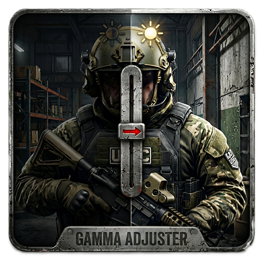
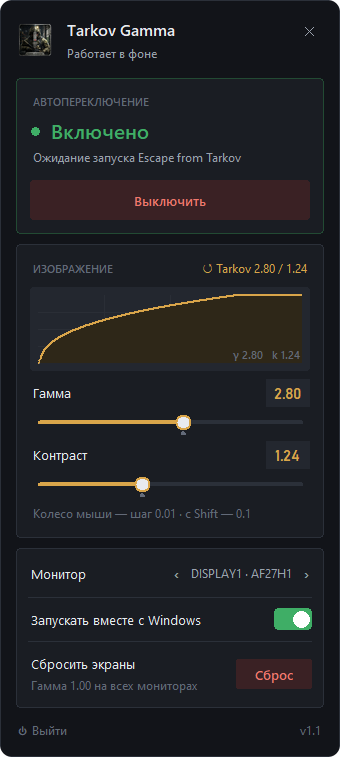

<div align="center">



# Tarkov Gamma Switcher

**Automatic display gamma for Escape from Tarkov — brighter nights in-game, normal colours everywhere else.**

[Русский](README.md) · English

</div>

---

Night raids in Escape from Tarkov are dark, and the in-game brightness slider only goes so far. Many players raise gamma in the GPU control panel, but then the whole desktop is washed out every time they alt-tab.

Tarkov Gamma Switcher sits in the system tray and changes the display gamma **only while the Tarkov window is in focus**. Alt-tab to Discord or a browser and the screen instantly returns to normal; switch back to the game and your gamma comes back.

<div align="center">

</div>

## Features

- **Automatic switching** — gamma is applied while `EscapeFromTarkov` is the foreground window and reset the moment it isn't.
- **Tray panel** — left-click the tray icon to open a compact panel above the taskbar; click anywhere else to hide it.
- **Live preview** — drag the gamma and contrast sliders (or type a value) and see the result on screen immediately, with a curve preview.
- **Sensible defaults** — gamma `2.80`, contrast `1.24`; one click restores them.
- **Multi-monitor** — choose which display the gamma is applied to.
- **Start with Windows** — optional, via a per-user autostart entry (no admin rights needed).
- **Emergency reset** — reset gamma on all monitors from the panel or the tray menu.
- **Single instance** — launching the app again just opens the existing panel.

## Download

Grab `TarkovGammaSwitcher.exe` from the [**Releases**](../../releases) page. It's a single portable file — no installer.

> Windows SmartScreen may warn about an unsigned executable. Click **More info → Run anyway**, or [build it yourself](#build-from-source).

## Usage

> The interface is currently in Russian; the original labels are shown below with translations.

1. Run `TarkovGammaSwitcher.exe`. The panel opens next to the tray; after that the app lives in the tray.
2. Make sure auto-switching is on — the status reads **Включено** (*On*) in green.
3. Adjust **Гамма** (*Gamma*) and **Контраст** (*Contrast*) if you like — the screen previews the values while you drag. Settings are saved when the panel closes.
4. Launch Tarkov. Gamma switches on when the game is focused and off when you alt-tab.

| Action | How |
| --- | --- |
| Open / hide the panel | Left-click the tray icon |
| Tray menu | Right-click the tray icon |
| Fine adjustment | Mouse wheel over a slider (±0.01), with <kbd>Shift</kbd> ±0.1 |
| Close the panel | <kbd>Esc</kbd> or click outside it |
| Quit completely | **Выйти** in the panel or **Выход** in the tray menu (*Exit*) |

The tray icon is coloured while auto-switching is on and grey while it's off.

## How it works

The app polls the foreground window every 0.5 s. When its title contains `EscapeFromTarkov`, it builds a gamma ramp from your gamma/contrast values and applies it with the Windows GDI function [`SetDeviceGammaRamp`](https://learn.microsoft.com/windows/win32/api/wingdi/nf-wingdi-setdevicegammaramp). When the game loses focus, the default linear ramp is restored. This is the same system-level mechanism that GPU control panels and tools like f.lux use.

It does **not** read or modify game files or memory, inject anything or interact with the game process in any way — it only looks at the title of the active window.

**Files and settings**

- Settings: `%APPDATA%\TarkovGammaSwitcher\config.json`
- Autostart: `HKCU\Software\Microsoft\Windows\CurrentVersion\Run` → `TarkovGammaSwitcher`

## Troubleshooting

**The screen stays bright/dark after closing the app.** Open the tray menu → **Сбросить экраны** (*Reset displays*), or run the app and press **Сброс** (*Reset*) in the panel. Every monitor goes back to gamma 1.00.

**Nothing changes on screen.**
- Windows *Night light*, HDR and some monitor/GPU colour tools override the gamma ramp — turn them off.
- Windows limits how far a gamma ramp can deviate from the default and silently ignores more extreme ones. If very high values have no effect, try lower ones.
- On multi-monitor setups, check that the right display is selected in the panel.

**The effect disappears in exclusive fullscreen.** Some drivers reset the gamma ramp in exclusive fullscreen. Use *Borderless* display mode in Tarkov.

## Build from source

Requires Windows, Python 3.14 and [uv](https://docs.astral.sh/uv/).

```powershell
git clone https://github.com/Medvedinca/TarkovGammaSwitcher.git
cd TarkovGammaSwitcher
uv sync
uv run main.py                                        # run from source
uv run pyinstaller --noconfirm TarkovGammaSwitcher.spec   # build dist\TarkovGammaSwitcher.exe
```

Pushing a tag like `v1.1.0` builds the executable with GitHub Actions and attaches it to a release.

## Disclaimer

This is an unofficial fan-made tool, not affiliated with or endorsed by Battlestate Games. Escape from Tarkov is a trademark of Battlestate Games. The app only changes Windows display settings, but use it at your own risk.

## License

[MIT](LICENSE)
